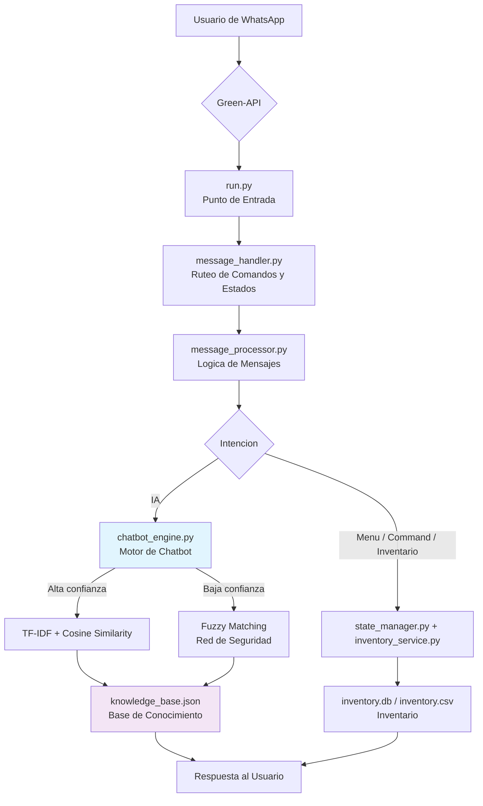

# Chatbot para WhatsApp con Machine Learning

[](https://www.python.org/)
[](https://scikit-learn.org/)
[](https://github.com/maxbachmann/RapidFuzz)
[](https://green-api.com/)

Chatbot para WhatsApp con **Machine Learning** que automatiza la atención al cliente de una PYME. Comprende lenguaje natural en español mediante un **motor de IA híbrido** (TF-IDF + similitud de coseno con respaldo de fuzzy matching), gestiona un **menú de conversación por estados** y resuelve consultas de **stock y precios** contra un inventario local intercambiable (SQLite o CSV).

## Caracteristicas Principales

- **Motor de IA hibrido**: Camino principal con **TF-IDF + similitud de coseno** sobre una base de conocimiento expandida con sinonimos; camino de respaldo con **RapidFuzz** para tolerar errores tipograficos y consultas parciales.
- **Menu por estados**: Menu conversacional con estados (`MENU_PRINCIPAL`, `ESPERANDO_PRODUCTO_STOCK`, `ESPERANDO_PRODUCTO_PRECIO`) gestionados en memoria.
- **Inventario multi-fuente**: Consultas de stock y precio via `buscar_producto()`, con fuente configurable (`INVENTORY_SOURCE_TYPE=sqlite|csv`).
- **Base de conocimiento externa**: Todo el conocimiento reside en `app/data/knowledge_base.json` (separacion dato/codigo).
- **Arquitectura modular**: `handlers` (ruteo), `services` (motor IA, inventario, estados) y `utils` (logging), patrón "monolito mejorado".
- **Testeo sin WhatsApp**: REPL local (`scripts/repl_local.py`) para probar el flujo completo de mensajes sin conectarse a Green-API.

## Arquitectura del Sistema



## Comenzando

### Prerrequisitos

- Python 3.12 o superior
- Cuenta en [Green-API](https://green-api.com/) (plan Developer gratuito disponible) — solo necesario para ejecutar en WhatsApp
- Número de teléfono secundario para el bot

### Instalacion

1. **Clonar el repositorio**

   ```bash
   git clone https://github.com/ITZ-NANO21-MC/Chatbot_With_ML.git
   cd Chatbot_With_ML
   ```

2. **Crear y activar entorno virtual**

   ```bash
   python -m venv venv
   source venv/bin/activate   # Linux/Mac
   venv\Scripts\activate       # Windows
   ```

3. **Instalar dependencias**

   ```bash
   pip install -r requirements.txt
   ```

4. **Configurar credenciales y opciones**

   Copia `.env.example` a `.env` y editalo:

   ```bash
   cp .env.example .env
   ```

   ```dotenv
   # Credenciales Green-API (WhatsApp)
   ID_INSTANCE="TU_ID_DE_INSTANCIA"
   API_TOKEN_INSTANCE="TU_TOKEN_DE_API"

   # Umbrales del motor de IA
   TFIDF_THRESHOLD=0.3
   FUZZY_THRESHOLD=70

   # Inventario: sqlite (default) o csv
   INVENTORY_SOURCE_TYPE="sqlite"
   INVENTORY_SQLITE_PATH="app/data/inventory.db"
   INVENTORY_CSV_PATH="app/data/inventory.csv"
   ```

   El proyecto no arranca sin credenciales validas: `ID_INSTANCE` y `API_TOKEN_INSTANCE` se validan antes de conectar con Green-API.

   **Importante:** `.env` esta excluido del control de versiones. Nunca lo compartas ni lo versiones.

5. **Configurar el numero de WhatsApp**

   - Ve a la consola de Green-API, crea una instancia (plan "Developer") y escanea el codigo QR con el numero dedicado al bot.

## Uso

### Ejecutar el bot en WhatsApp

```bash
python run.py
```

El bot validará credenciales e iniciará GreenAPIBot:

```
2026-09-22 10:30:00 - run - INFO - Iniciando la aplicacion del chatbot...
2026-09-22 10:30:01 - app.services.chatbot_engine - INFO - Inicializando ChatbotEngine...
2026-09-22 10:30:01 - app.services.chatbot_engine - INFO - Cargando base de conocimiento desde: app/data/knowledge_base.json
2026-09-22 10:30:01 - app.services.chatbot_engine - INFO - Datos expandidos: 5 -> 17 preguntas
2026-09-22 10:30:02 - run - INFO - Handlers registrados exitosamente.
2026-09-22 10:30:02 - run - INFO - Bot iniciado. Escuchando mensajes...
```

### Probar localmente sin WhatsApp (REPL)

```bash
printf '/stock\npantalla iphone\n' | python scripts/repl_local.py
```

Ejecutar el REPL **no** conecta con Green-API: procesa los mensajes con el mismo `message_processor.py` que usa WhatsApp, mostrando la respuesta y el estado de conversación.

### Menu y comandos

| Entrada | Accion |
|---|---|
| `1` (menú) / `/stock` | Consultar stock de un producto (pide el nombre) |
| `2` (menú) / `/precio` | Consultar precio de un producto (pide el nombre) |
| `3` | Información de contacto y horario |
| `4` | Hablar con el asistente inteligente (IA) |
| `/ayuda` | Mostrar lista de comandos |
| `/contacto` | Información de contacto |
| `/horario` | Horarios de atención |
| cualquier texto | IA: TF-IDF + cosine similarity, con fallback fuzzy |

## Pruebas (Testing)

El proyecto usa `pytest`. Ejecuta desde la raiz con las dependencias instaladas:

```bash
pytest
```

Suite actual: **39 pruebas** (motor de IA, procesador de mensajes, handlers, config, inventario SQLite/CSV e integración de flujos).

## Estructura del Proyecto

```
Chatbot_With_ML/
├── run.py                     # Punto de entrada: valida .env → ChatbotEngine → GreenAPIBot → register_handlers
├── scripts/
│   └── repl_local.py          # REPL local de pruebas (sin WhatsApp)
├── app/
│   ├── config.py              # Carga .env; credenciales, umbrales y rutas de inventario
│   ├── handlers/
│   │   └── message_handler.py # register_handlers(): ruteo de comandos + menu + fallback IA
│   ├── services/
│   │   ├── chatbot_engine.py  # TF-IDF + cosine similarity, fallback RapidFuzz
│   │   ├── inventory_service.py # buscar_producto(): SQLite o CSV con fuzzy matching
│   │   ├── message_processor.py  # Logica de mensajes y maquina de estados
│   │   └── state_manager.py   # Estado por usuario en memoria (3 estados)
│   ├── utils/
│   │   └── logger.py          # Logging centralizado (chatbot_operations.log + stdout)
│   └── data/
│       ├── knowledge_base.json # Base de conocimiento (JSON)
│       ├── inventory.db        # Inventario SQLite (tabla `productos`)
│       └── inventory.csv       # Inventario CSV de respaldo
├── tests/                     # Suite pytest (39 pruebas)
├── .context/                  # Documentacion de diseno (CONTEXT, ROADMAP, STATE, DECISIONS, PATTERNS, WORKFLOW)
├── .env.example               # Plantilla de configuración
├── requirements.txt
└── README.md
```

### Base de conocimiento (`knowledge_base.json`)

```json
{
  "conocimiento": [
    {
      "pregunta_base": "hola",
      "respuesta": "¡Hola! Soy tu asistente virtual. ¿En qué puedo ayudarte?",
      "sinonimos": ["saludos", "buenas", "qué tal"]
    }
  ]
}
```

## Configuracion de Inventario

El inventario vive en `app/data/inventory.db` (SQLite, default) o `app/data/inventory.csv`, con columnas `nombre`, `precio`, `stock`. Cambia la fuente activa con `INVENTORY_SOURCE_TYPE`:

```dotenv
INVENTORY_SOURCE_TYPE="csv"
```

La busqueda usa un scorer combinado (WRatio + partial_ratio) que tolera errores tipograficos y consultas parciales ("cargador tipo c" encuentra "Cargador Tipo C Rapido"), con umbral configurable en `FUZZY_THRESHOLD`.

## Estado del Proyecto

**Estable para pruebas y produccion a pequena escala** (con credenciales Green-API reales).

- Suites de tests completas y en verde (39 pruebas)
- Flujo completo verificado con REPL local (menu, stock, precio, IA)
- Inventario funcional con SQLite y CSV

**Limitaciones conocidas:**

- La conversacion se mantiene solo en memoria: los estados se reinician si el proceso se detiene
- La base de conocimiento se carga al inicio: editar `knowledge_base.json` exige reiniciar
- El plan Developer de Green-API permite pocos chats simultaneos
- Sin interfaz web ni API de administracion

## Roadmap

- Validacion de estado de instancia en Green-API antes de iniciar (`authorized`)
- Persistencia de conversaciones (estados multi-turno sobre SQLite/Redis)
- Cache de vectores TF-IDF para reducir procesamiento
- Metricas de rendimiento en tiempo real (exitos/fallos TF-IDF vs fuzzy)
- Respuestas humanizadas con variaciones
- Sistema de feedback de respuestas ("¿Fue util?")
- API REST de administracion para editar la base de conocimiento en caliente (evitar reinicios)

## Licencia

MIT — ver [LICENSE](LICENSE).