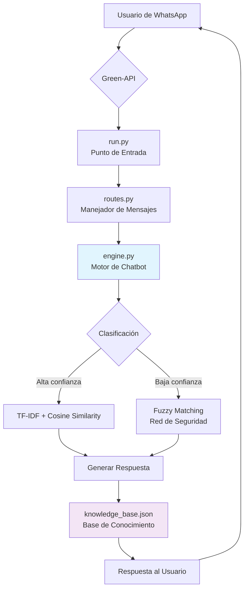

# 🤖 Chatbot para WhatsApp con Machine Learning

[](https://www.python.org/)
[](https://scikit-learn.org/)
[](https://green-api.com/)
[](LICENSE)

Un chatbot inteligente para WhatsApp que utiliza **Machine Learning** (scikit-learn) para comprender el lenguaje natural y responder consultas de forma contextual. Diseñado con una arquitectura modular profesional, fácil de extender y desplegar.

## ✨ Características Principales

- **🧠 Motor de IA Híbrido**: Combina la precisión de **TF-IDF y similitud de coseno** con un sistema de respaldo de **fuzzy matching** para manejar errores tipográficos.
- **📚 Base de Conocimiento Externa**: Todo el conocimiento del bot reside en un archivo JSON, permitiendo actualizaciones sin modificar el código.
- **🛡️ Robustez Industrial**: Manejo de errores exhaustivo y sistema de logging completo para monitorización en producción.
- **🔌 Arquitectura Modular**: Separación clara de responsabilidades (API, motor de IA, datos) siguiendo el patrón "monolito mejorado".
- **⚡ Fácil Integración**: Listo para conectar con WhatsApp a través de la API de Green-API con configuración mínima.

## 🏗️ Arquitectura del Sistema



## 🚀 Comenzando

### 📋 Prerrequisitos

- Python 3.8 o superior
- Cuenta en [Green-API](https://green-api.com/) (plan Developer gratuito disponible)
- Número de teléfono secundario para el bot (no puede ser tu número personal principal)

### 🔧 Instalación

1. **Clonar el repositorio**
   ```bash
   git clone https://github.com/ITZ-NANO21-MC/Chatbot_With_ML.git
   cd chatbot-whatsapp-ml
   ```

2. **Crear y activar entorno virtual**
   ```bash
   python -m venv venv
   # En Linux/Mac:
   source venv/bin/activate
   # En Windows:
   venv\Scripts\activate
   ```

3. **Instalar dependencias**
   ```bash
   pip install -r requirements.txt
   ```

4. **Configurar credenciales**
   Este proyecto usa un archivo `.env` para gestionar las credenciales de forma segura.

   a. **Crear el archivo de entorno:**
   Copia el archivo de ejemplo `.env.example` y renómbralo a `.env`.
   ```bash
   # En Linux/Mac:
   cp .env.example .env
   # En Windows:
   copy .env.example .env
   ```

   b. **Añadir tus credenciales:**
   Abre el nuevo archivo `.env` y añade tus credenciales de Green-API:
   ```dotenv
   ID_INSTANCE="TU_ID_DE_INSTANCIA"
   API_TOKEN_INSTANCE="TU_TOKEN_DE_API"
   ```
   **Importante:** El archivo `.env` está excluido del control de versiones por seguridad. Nunca compartas este archivo.

5. **Configurar número de WhatsApp**
   - Ve a la consola de Green-API
   - Crea una nueva instancia (plan "Developer" para pruebas)
   - Escanea el código QR con la app de WhatsApp de tu número dedicado al bot

## 📖 Uso

### Ejecución Local
```bash
python run.py
```

El bot se iniciará y mostrará:
```
2025-12-01 10:30:00 - __main__ - INFO - Iniciando la aplicación del chatbot...
2025-12-01 10:30:01 - app.chatbot.engine - INFO - Inicializando ChatbotEngine...
2025-12-01 10:30:01 - app.chatbot.engine - INFO - Cargando base de conocimiento desde: app/data/knowledge_base.json
2025-12-01 10:30:01 - app.chatbot.engine - INFO - Datos expandidos: 5 -> 14 preguntas
2025-12-01 10:30:01 - app.chatbot.engine - INFO - Bot iniciado. Escuchando mensajes...
```

### Pruebas Básicas
Envía estos mensajes a tu número del bot desde WhatsApp:

| Mensaje del Usuario | Respuesta Esperada | Mecanismo Activado |
|---------------------|-------------------|-------------------|
| "hola" | "¡Hola! Soy tu bot asistente." | TF-IDF (exacto) |
| "buenas tardes" | "¡Hola! Soy tu bot asistente." | TF-IDF (sinónimo) |
| "qé haces" | "Puedo responder preguntas simples..." | Fuzzy Matching |
| "información" | "No estoy seguro de entender..." | Fallback |

## 🧪 Pruebas (Testing)

Este proyecto utiliza `pytest` para las pruebas unitarias. Las pruebas se encuentran en el directorio `tests/`.

Para ejecutar las pruebas, asegúrate de haber instalado todas las dependencias (incluyendo `pytest` y `pytest-mock`) y luego ejecuta el siguiente comando desde el directorio raíz del proyecto (`Chatbot_wha`):

```bash
pytest
```

Esto descubrirá y ejecutará automáticamente todas las pruebas en el directorio `tests/`, mostrando un resumen de los resultados.

## 📁 Estructura del Proyecto

```
chatbot-whatsapp-ml/
├── 📁 app/
│   ├── 📁 api/
│   │   ├── __init__.py
│   │   └── routes.py          # Manejadores de la API de WhatsApp
│   ├── 📁 chatbot/
│   │   ├── __init__.py
│   │   └── engine.py          # Motor de IA principal
│   ├── 📁 data/
│   │   └── knowledge_base.json # Base de conocimiento
│   └── config.py              # Configuraciones y credenciales
├── 📁 docs/                   # Documentación adicional
├── 📁 tests/                  # Pruebas unitarias
├── requirements.txt           # Dependencias
├── run.py                    # Punto de entrada principal
├── chatbot_operations.log    # Log generado automáticamente
└── README.md                 # Este archivo
```

### Base de Conocimiento (`knowledge_base.json`)
```json
{
  "conocimiento": [
    {
      "pregunta_base": "hola",
      "respuesta": "¡Hola! Soy tu bot asistente.",
      "sinonimos": ["saludos", "buenas", "qué tal"]
    }
  ]
}
```

## 🔮 Roadmap y Mejoras Futuras

### 🚀 **Mejoras Técnicas (Backend)**
| Prioridad | Mejora | Descripción | Impacto |
|-----------|--------|-------------|---------|
| Alta | **Validación de Estado de Instancia** | Verificar automáticamente que la instancia de Green-API esté `authorized` antes de iniciar. | Evita errores silenciosos y mejora la experiencia de desarrollo. |
| Alta | **Umbrales Dinámicos Configurables** | Mover umbrales de confianza (0.3) y fuzzy (70) a `config.py` para ajuste fácil. | Mayor flexibilidad sin modificar código. |
| Media | **Sistema de Caché de Embeddings** | Cachear vectores TF-IDF de preguntas frecuentes para reducir procesamiento. | Mejora rendimiento en despliegues con muchos usuarios. |
| Media | **Métricas de Rendimiento en Tiempo Real** | Contadores para éxitos/fallos de TF-IDF vs Fuzzy, confianza promedio, etc. | Mejor monitorización y toma de decisiones. |

### ✨ **Mejoras de Experiencia de Usuario (UX)**
| Prioridad | Mejora | Descripción | Beneficio |
|-----------|--------|-------------|-----------|
| Alta | **Respuestas Humanizadas con Variaciones** | Múltiples respuestas por intención y selección aleatoria. | Evita respuestas robóticas y repetitivas. |
| Alta | **Manejo de Contexto Multi-Turno** | Recordar la última intención para diálogos como "¿su precio?" → "del producto X". | Conversaciones más naturales y útiles. |
| Media | **Soporte para Comandos Específicos** | Comandos como `/ayuda`, `/info`, `/reset`. | Interfaz más intuitiva y descubrible. |
| Media | **Sistema de Feedback de Respuestas** | Opción "¿Fue útil esta respuesta?" para aprender de interacciones reales. | Mejora continua basada en datos reales. |
| Baja | **Soporte para Multimedia** | Manejo básico de imágenes/audios con respuestas predefinidas. | Mayor interactividad. |

### 🧩 **Mejoras de Extensibilidad**
| Prioridad | Mejora | Descripción | Uso Caso |
|-----------|--------|-------------|----------|
| Media | **Sistema de Plugins/Extensiones** | Arquitectura para añadir módulos (clima, cotizaciones, etc.) sin tocar el núcleo. | Facilita colaboración y características adicionales. |
| Media | **API REST para Administración** | Endpoints para añadir/eliminar preguntas-respuestas en caliente. | Administración remota sin reinicios. |
| Baja | **Interfaz Web de Administración** | Panel web para ver logs, métricas y editar la base de conocimiento. | Mejor experiencia de administración. |

### 🧪 **Ejemplo de Implementación: Respuestas Humanizadas**
```json
{
  "pregunta_base": "hola",
  "respuestas": [
    "¡Hola! Soy tu bot asistente. ¿En qué puedo ayudarte?",
    "¡Hola! Qué gusto saludarte. ¿Cómo estás?",
    "¡Buenas! Estoy aquí para ayudarte."
  ],
  "sinonimos": ["saludos", "buenas", "qué tal"]
}
```

```python
# En engine.py, método responder()
import random
# ...
if respuesta:
    if isinstance(respuesta, list):  # Múltiples respuestas disponibles
        respuesta_elegida = random.choice(respuesta)
        self.logger.info(f"Seleccionada respuesta variante #{respuestas.index(respuesta_elegida)}")
        return respuesta_elegida
```

## 📊 Estado del Proyecto

**Estable - Listo para Producción (Pequeña Escala)**

El bot está completamente funcional y ha sido probado con:
- ✅ Clasificación precisa de intenciones con TF-IDF
- ✅ Manejo robusto de errores tipográficos con Fuzzy Matching
- ✅ Integración estable con WhatsApp vía Green-API
- ✅ Logging completo para monitorización

**Limitaciones Conocidas:**
- El plan Developer de Green-API permite solo 3 chats simultáneos
- Procesamiento de lenguaje natural en español básico (sin modelos transformer)
- Sin persistencia de conversaciones entre reinicios

## 🤝 Contribuir

Las contribuciones son bienvenidas. Por favor:

1. Haz fork del repositorio
2. Crea una rama para tu funcionalidad (`git checkout -b feature/AmazingFeature`)
3. Commitea tus cambios (`git commit -m 'Add some AmazingFeature'`)
4. Push a la rama (`git push origin feature/AmazingFeature`)
5. Abre un Pull Request

Consulta el archivo `CONTRIBUTING.md` para pautas detalladas.

## 📄 Licencia

Este proyecto está bajo la Licencia MIT - ver el archivo [LICENSE](LICENSE) para detalles.

## 🙏 Agradecimientos

- **[Green-API](https://green-api.com/)** por proporcionar una API de WhatsApp accesible
- **[Scikit-learn](https://scikit-learn.org/)** por las herramientas de ML
- **[RapidFuzz](https://github.com/maxbachmann/RapidFuzz)** por la excelente librería de fuzzy matching

---

